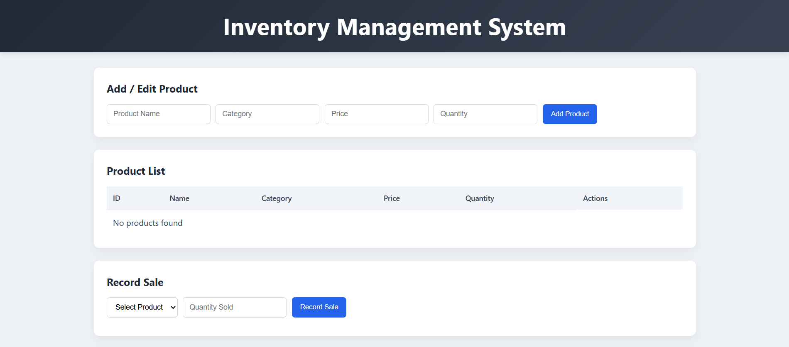
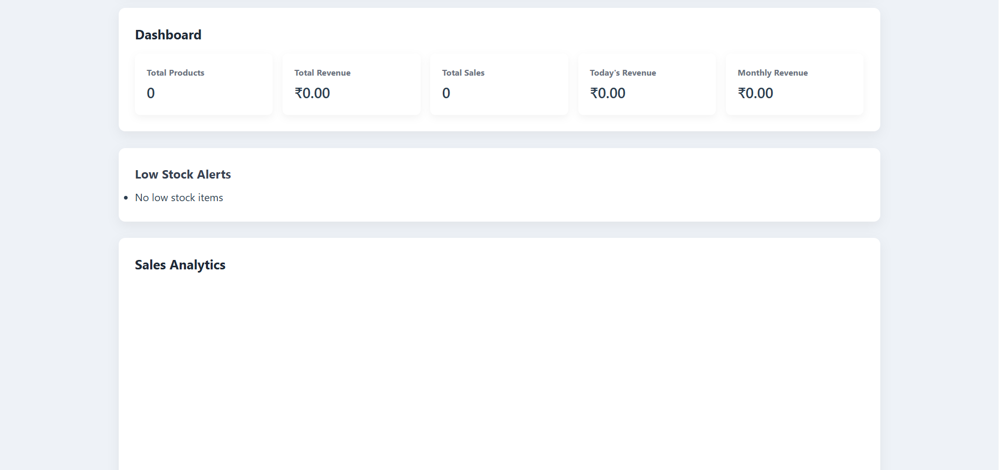

# 📦 Inventory Management System

A full-stack Inventory Management System built with **Node.js, Express, MySQL, and Vanilla JavaScript** that helps manage products, track sales, monitor stock, and visualize revenue analytics using charts.

This project includes:

* Product management (CRUD)
* Sales recording with stock updates
* Revenue analytics (daily & monthly)
* Dashboard metrics
* Low stock alerts
* Charts for data visualization

---

# 🚀 Features

### 📦 Product Management

* Add new products
* Edit existing products
* Delete products
* View product list
* Low stock highlighting

### 💰 Sales Management

* Record product sales
* Automatic stock deduction
* Transaction-safe database operations

### 📊 Analytics & Dashboard

* Total revenue
* Total sales
* Today's revenue
* Monthly revenue
* Low stock alerts
* Daily revenue chart
* Monthly revenue chart
* Revenue by category
* Top selling products

### 🔐 Backend Security

* Helmet security headers
* CORS enabled
* Rate limiting
* Error handling middleware

---

# 🛠 Tech Stack

### Frontend

* HTML
* CSS
* JavaScript
* Chart.js

### Backend

* Node.js
* Express.js
* MySQL
* mysql2

### Database

* MySQL (MySQL Workbench supported)

---

# 📁 Project Structure

```
inventory-management-system/
│
├── backend/
│   ├── config/
│   │   └── db.js
│   ├── routes/
│   │   ├── productRoutes.js
│   │   ├── salesRoutes.js
│   │   ├── analyticsRoutes.js
│   │   └── dashboardRoutes.js
│   ├── server.js
│   └── .env
│
├── frontend/
│   ├── css/
│   │   └── style.css
│   ├── js/
│   │   ├── products.js
│   │   ├── sales.js
│   │   ├── dashboard.js
│   │   └── charts.js
│   └── index.html
│
└── database/
    └── schema.sql
```

---

# ⚙️ Installation & Setup

## 1️⃣ Clone Repository

```
git clone https://github.com/yourusername/inventory-management-system.git
cd inventory-management-system
```

---

## 2️⃣ Setup Database (MySQL)

Open **MySQL Workbench** and run the SQL file:

```
database/schema.sql
```

This will create:

* inventory_db database
* products table
* sales table

---

## 3️⃣ Backend Setup

Navigate to backend folder:

```
cd backend
```

Install dependencies:

```
npm install
```

Create `.env` file:

```
PORT=5000
DB_HOST=localhost
DB_USER=root
DB_PASSWORD=root
DB_NAME=inventory_db
```

Start server:

```
node server.js
```

Server will run at:

```
http://localhost:5000
```

Test API health:

```
http://localhost:5000/
```

---

## 4️⃣ Frontend Setup

Open frontend folder in VS Code.

Run with Live Server OR open index.html in browser.

```
frontend/index.html
```

---

# 📡 API Endpoints

## Products

| Method | Endpoint          | Description        |
| ------ | ----------------- | ------------------ |
| GET    | /api/products     | Get all products   |
| GET    | /api/products/:id | Get single product |
| POST   | /api/products     | Create product     |
| PUT    | /api/products/:id | Update product     |
| DELETE | /api/products/:id | Delete product     |

## Sales

| Method | Endpoint                    | Description         |
| ------ | --------------------------- | ------------------- |
| POST   | /api/sales                  | Record sale         |
| GET    | /api/sales/summary          | Dashboard summary   |
| GET    | /api/sales/category-revenue | Revenue by category |

## Analytics

| Endpoint                       | Description     |
| ------------------------------ | --------------- |
| /api/analytics/daily-revenue   | Daily revenue   |
| /api/analytics/monthly-revenue | Monthly revenue |

---

# 📊 Dashboard Metrics

* Total Products
* Total Revenue
* Total Sales
* Today's Revenue
* Monthly Revenue
* Low Stock Items

---

# 🧪 Testing the System

1. Add products
2. Record sales
3. Check dashboard updates
4. Verify charts
5. Check stock reduction

---

# 🐞 Troubleshooting

### Port already in use

Change port in `.env` file or stop running process.

---

### Database connection failed

Check:

* MySQL running
* credentials correct
* database exists

---

### API returning 404

Ensure server is running and routes are defined.

---

# 🌐 Deployment

## Deploy Backend

* Render
* Railway
* VPS
* Docker

## Deploy Frontend

* GitHub Pages
* Netlify
* Vercel

---

# 👨‍💻 Author

Developed as a full-stack learning project.

---

# ⭐ Future Improvements

* User authentication
* Role based access
* PDF reports
* Export data
* Email alerts
* Barcode scanner
* Advanced analytics

---

# 📜 License

This project is open source and free to use.

---

## 📸 Screenshot





